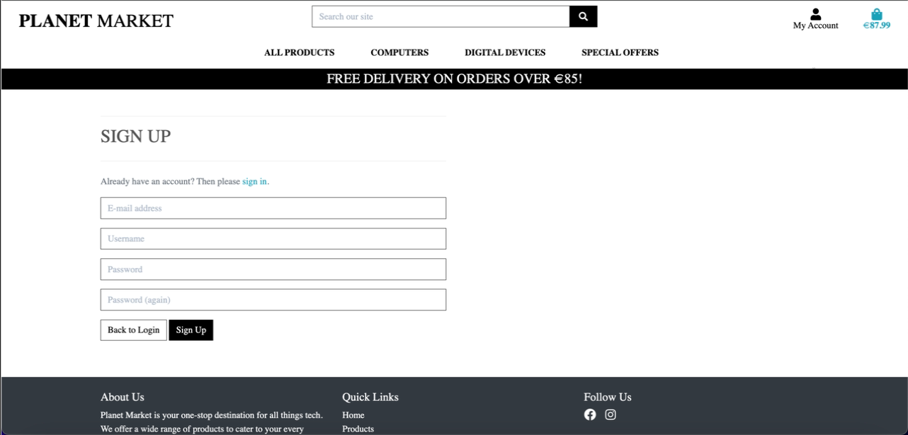
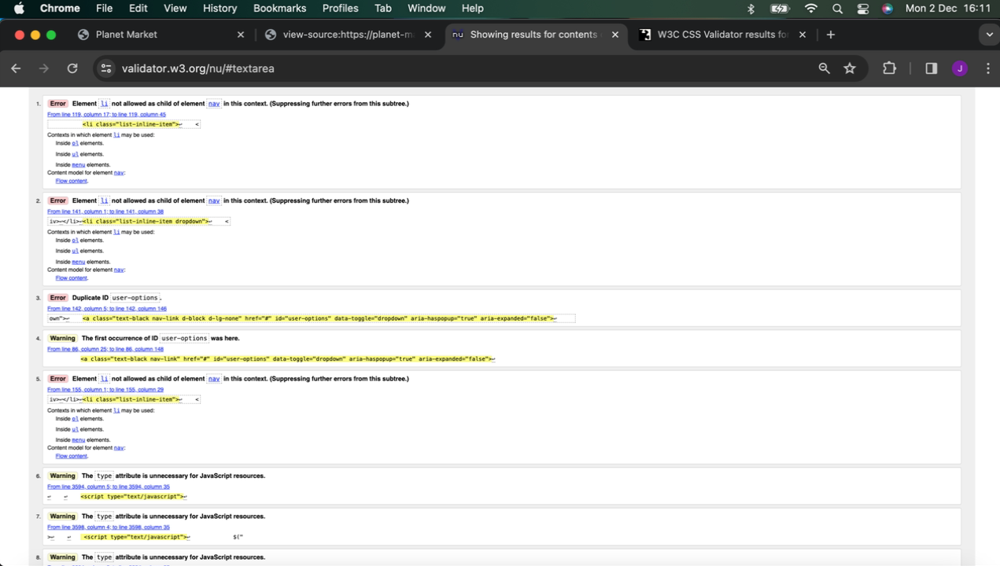

# --Planet Market--

[Live Site](https://planet-market-ef36a376b17d.herokuapp.com/)


## Table of Contents

1. [Project Overview](#project-overview)
      - [Objective](#objective)
      - [Key Features](#key-features)
      - [User-Centric Experience](#user-centric-experience)
      - [Admin Functionality](#admin-functionality)
      - [Secure Transactions](#secure-transactions)
      - [Deployment and Hosting](#deployment-and-hosting)
      - [Technical Stack](#technical-stack)
      - [Significance](#significance)
      - [Target Audience](#target-audience)
2. [Project Approach](#project-approach)
      - [Agile Framework Overview](#agile-framework-overview)
      - [GitHub Configuration](#github-configuration)
      - [Projects + Kanban Board](#projects--kanban-board)
      - [Epics as Milestones](#epics-as-milestones)
      - [User Stories](#user-stories)
      - [Development Process](#development-process)
      - [Testing and Feedback](#testing-and-feedback)
      - [Deployment and Review](#deployment-and-review)
3. [User Experience](#user-experience)
      - [UI Features](#ui-features)
      - [Functional Features](#functional-features)
4. [Design](#design)
      - [Fonts used](#fonts-used)
      - [Wireframe design](#wireframe-design)
      - [Color](#color)
5. [Data Model](#data-model)
      - [ERD Diagram](#erd-diagram)
6. [Epics and User Stories](#epics-and-user-stories)
      - [Project Goals](#project-goals)
      - [User Goals](#user-goals)
      - [Returning User Goals](#returning-user-goals)
      - [Website Owner Goals](#website-owner-goals)
7. [Business Model](#business-model)
      - [Outline](#outline)
8. [Validation](#validation)
      - [W3C HTML and CCS Validation](#w3c-html-and-ccs-validation)
9. [Testing](#testing)
      - [Test Cases](#test-cases)
      - [Bugs](#bugs)
10. [Development](#development)
      - [Future Developments](#future-developments)
      - [Technologies and Languages Used](#technologies-and-languages-used)
      - [Environments](#environments)
      - [Key Differences: Gitpod vs Heroku](#key-differences-gitpod-vs-heroku)
11. [Deployment](#deployment)
      - [Setting Up P Project](#setting-up-p-project)
      - [Setting Up Heroku](#setting-up-heroku)
      - [Connecting to GitHub](#connecting-to-github)
      - [Admin Credentials](#admin-credentials)
      - [Environmental Variables](#environmental-variables)
      - [Setting Up Environment Variables](#setting-up-environment-variables)
      - [Deploying My Code](#deploying-my-code)
      - [Checking My Site](#checking-my-site)
      - [Troubleshooting Tips](#troubleshooting-tips)
      - [Useful Commands I Used](#useful-commands-i-used)
      - [Some Notes](#some-notes)
12. [Acknowledgements](#acknowledgements)
      - [Developer Note](#developer-note)
      - [Readme Reformat](#readme-reformat)
      - [Citations](#citations)

# Project Overview

> Planet Market - Project Overview <br>
> Project Title: Planet Market <br>
> Project Type: Full-Stack E-commerce Website <br>
> Course: Code Institute Full Stack Software Development (Portfolio Project 5) <br>

### Objective

Planet Market is a fictional e-commerce platform designed to showcase the development of a responsive and secure full-stack web application using Django, PostgreSQL, and Amazon AWS S3. The goal is to create a functional online store where users can browse and purchase electronic and digital hardware.

### Key Features

Responsive Design:

- Built with a mobile-first approach to ensure compatibility across all devices.
- Features a clean, modern, and minimalistic design with an elegant font and neutral color palette.

### User-Centric Experience

- Easy user registration and authentication.
- Intuitive navigation for browsing and filtering products.
- Seamless shopping experience with a clear and simple checkout process.

### Admin Functionality

- Product management capabilities for admins, allowing easy updates to the product catalog.

### Secure Transactions

- Integrated with Stripe for safe and straightforward payment processing.

### Deployment and Hosting

- Deployed on Heroku for high availability and scalability.
- Static and media file storage handled by AWS S3, ensuring reliable content delivery.

### Technical Stack

- Frontend: Responsive HTML, CSS, JavaScript
- Backend: Django Framework
- Database: PostgreSQL
- Payment Gateway: Stripe
- Deployment Platform: Heroku
- Static and Media Storage: Amazon AWS S3

### Significance

- This project highlights my ability to develop a complete, feature-rich full-stack web application, blending frontend responsiveness with robust backend functionality. It demonstrates proficiency in creating a modern e-commerce site that is both user-friendly and scalable, fulfilling real-world usability standards.

### Target Audience

- Customers looking for an online store for electronics and digital hardware.
- Business Owners seeking an intuitive admin interface for managing inventory and sales.

> By building Planet Market, I successfully consolidated my learning from the Code Institute course, showcasing practical expertise in full-stack development and deployment.

## Project Approach

> Project Approach for Planet Market (Agile Methodology with GitHub Integration)

### Agile Framework Overview

The development of Planet Market followed an Agile methodology, using GitHub as the primary project management tool. This approach provided an iterative, structured process for development, allowing flexibility and continuous feedback to refine the website.

This was the second time I practiced agile in the development and planning of my project. Recentlyt I learn more about user stories, epics and features from this [resource](https://www.gla.ac.uk/media/Media_730149_smxx.pdf "Glasgow University: Epics, User Stories and Features")

The following were defined in GitHub, as the my main Agile management tool.

### GitHub Configuration

I set up the following:

1. GitHub Templates:
  Via repository settings:

- User_Story.md: To defined the user needs, tasks to complete and user acceptance criteria.
- Feedback.md: To document the submission feedback fixes.
- Bugs.md: To document the bugs found in submission.

2. GitHub Labels - for MoSCoW priority
3. GitHub Project - for Agile Management
4. GitHub Milestone for Epics
5. GitHub Issues - for user stories, tasks and acceptance criteria as well as bugs and feedback.

### Projects + Kanban Board

- <https://github.com/features/issues>
- <https://docs.github.com/en/issues/planning-and-tracking-with-projects>

1. The GitHub Project used for this project is here.
2. Kanban Board was configured
3. MoSCoW Priority Matrix added as [labels for issues and on the project board](https://docs.github.com/en/issues/planning-and-tracking-with-projects).

| MoSCoW Label | Implementation                                                   | Role in Development                                           | User Story |
|--------------|------------------------------------------------------------------|---------------------------------------------------------------|------------|
| Must Have    | Essential features that are crucial for the project's success    | Core functionality, non-negotiable                            | `Need`     |
| Should Have  | Important but not vital features                                 | High priority, implement if possible                          | `Want`     |
| Could Have   | Desirable features that are not necessary for core functionality | Nice-to-have, implement if time/resources allow               | `Like`     |
| Won't Have   | Features that are not planned for the current project scope      | Excluded from current development, potential future additions | `Don't`    |

See the basic user story template below.

### Epics as Milestones

- See [GitHub Milestones](https://github.com/dutchmims/Planet_Market/milestones)

I created 8 Milestones, aliging with the learning outcomes of the Code Institute PP5 Course handbook, and I merged LO 5 and LO6 into one Epic: BIZDEV

- EPIC Logic = LO: 1 Coding, Intent and Django
- EPIC Plan = LO: 2 GitHub and Agile
- EPIC UI = LO: 2 UI & Design
- EPIC SEO = LO: 3 SEO
- EPIC Auth = LO: 4 User Authentication
- EPIC BizDev = LO: 5 Socials and Marketing ( Overlap of LO 5 and 6 )
- EPIC BizDev = LO 6 Business Model and Plan ( Overlap of LO 5 and 6 )
- EPIC Docs: Readme and documentation

### User Stories

I created a list of user stories to assist in the development and implementation writing code and building the website.

An example basic user story template is, and has hint to prioritising in need|shoul|like|don't:

```
As a <user_type>
I <need|should|like|don't> to <action>
So that | Because <why>
```

- Each user story breaks up the project in to small chunks which can be tackled individually, eventually each on the back of the previous to build a complete working site.
- With each user story only a part of the site is worked on.
- With each user story completed, I moved on to the next and would then run in to bugs and errors which would require fixing before moving on.

#### Tasks

I listed, in GitHub Issues / Project Board, checkbox task list that define the steps I took to complete the user story.

#### User Acceptance Criteria

I listed, in GitHub Issues / Project Board, the user story testing criteria and steps to accept the user story, so to mark it complete and closed.

### Development Process

Each sprint was focused on completing a set of user stories, delivering incremental progress.

#### Sprint Workflow

1. Add user stories and tasks to the Kanban board under "To Do."
2. Move tasks to "In Progress" during active development.
3. Conduct testing and peer reviews for tasks in "In Review."
4. Mark tasks as "Completed" once approved.

#### Key Features by Sprint

These are rough ideas of a plan.

- Sprint 1: Environment setup, database models, user authentication, admin panel.
- Sprint 2: Product catalog, filtering functionality, and responsive design.
- Sprint 3: Shopping cart, checkout process with Stripe payment integration.
- Sprint 4: Initial deployment to Heroku, and AWS S3 integration.

> *Submission*

- Sprint 4: Feedback into GitHub (Fixes) and readme setup for submission.
- Sprint 5: Newsletter subscription and discount codes and other feedback changes.
- Sprint 6: Final deployment to Heroku inclusive of feedback changes.

> *Submission*

### Testing and Feedback

- Manual testing of user flows like login, browsing, and checkout.

#### Bug Tracking

- Bugs were documented using the Bugs.md template and tracked on the GitHub Project board.

#### Feedback Management

- Fixes and improvements based on submission feedback were documented using the Feedback.md template.

### Deployment and Review

#### Final Deployment

- Deployed the application on Heroku, with static and media files hosted on AWS S3.
- Ensured a production-ready setup by managing environment variables and conducting final tests.

#### Review

##### What went well?

- Efficient use of GitHub tools for Agile management.
- Integration of feedback during sprints improved the final product.

##### Challenges

- Managing unexpected bugs delayed certain milestones.

##### Improvements

- Allocate more time for testing and feature development.
- By combining Agile methodology with GitHub tools, the project was managed efficiently, ensuring high-quality deliverables through incremental and iterative progress.

> ---

# User Experience

## UI Features

| Feature Name             | Feature Description                                                                                                                                        | User Story Ref |
|--------------------------|------------------------------------------------------------------------------------------------------------------------------------------------------------|----------------|
| Header                   | The header is showing the website name and logo on the left, the 4 dropdown menus as we go from right to left and the My Account and Bag on the top right. |                |
| My Account               | The home page includes an image with text. This lets the viewer know what the website is about and what's coming next.                                     |                |
| Register                 | Used Django AllAuth for authentication. Edited HTML pages to match website style, UX, font, and color palette.                                             |                |
| Login                    | Used Django AllAuth for authentication on the ecommerce site.                                                                                              |                |
| Bag                      | Created a shopping bag to hold selected products until payment screen and final purchase. Products can be edited in the bag.                               |                |
| CTA                      | CTA button 'Shop Now' on the homepage that brings user to All Products page.                                                                               |                |
| Search Bar               | Allows one to search for what they want to find.                                                                                                           |                |
| All Products Dropdown    | Filtering options: By Price, By Rating, By Category, All Products                                                                                          |                |
| Computers Dropdown       | Product categories: Desktops, Laptops, Notebooks, Tablets                                                                                                  |                |
| Digital Devices Dropdown | Product categories: Phones, Digital Watches, Fitness Trackers                                                                                              |                |
| Special Offers Dropdown  | Categories: New Arrivals, Deals, Clearance, All Specials                                                                                                   |                |
| Main Page                |                                                                                                                                                            |                |
| Footer                   |                                                                                                                                                            |                |

> - From the original readme. Turned a list into a table with Perplexity.ai <br>
>
> ---

## Functional Features

> - New to the original readme.

| Feature ID | Feature Name             | Description                                                         | User Acceptance Criteria                                                                                                                                                                          |
|------------|--------------------------|---------------------------------------------------------------------|---------------------------------------------------------------------------------------------------------------------------------------------------------------------------------------------------|
| AUTH-001   | User Registration        | Allows new users to create an account on the Planet Market platform | - Users can create an account with email and password<br>- Email verification is required<br>- Password meets security requirements<br>- Successful registration leads to account creation        |
| AUTH-002   | User Authentication      | Secure login system for registered users to access their accounts   | - Users can log in with valid credentials<br>- Invalid credentials are properly handled<br>- User session is maintained<br>- Login state is clearly indicated                                     |
| PROD-001   | Product Catalog          | Browsable product listing with filtering and sorting capabilities   | - Products are displayed in a grid/list view<br>- Category filters are available<br>- Sort options work (price, name)<br>- Product images load properly<br>- Mobile-responsive display            |
| PROD-002   | Product Search           | Search functionality allowing users to find specific products       | - Search by keywords<br>- Results are relevant to search terms<br>- Empty searches are handled gracefully<br>- Special characters don't break search<br>- Partial matches are supported           |
| PROD-003   | Product Management       | Add new, list, edit or delete specific products by Staff only       | - Add a new product<br>- View, listing inventory<br>- Edit specific product details<br>- Remove, delete a product                                                                                 |
| BAG-001    | Shopping Cart            | Digital cart system for collecting items before purchase            | - Items can be added with specified quantities<br>- Cart total updates automatically<br>- Items persist in cart during session<br>- Clear visual feedback when items are added                    |
| BAG-002    | Cart Management          | Tools to modify cart contents and review before checkout            | - Quantities can be updated<br>- Items can be removed<br>- Price calculations are accurate<br>- Empty cart state is handled properly<br>- Continue shopping option available                      |
| CHECK-001  | Guest Checkout           | Allows non-registered users to complete purchases                   | - Shipping information can be entered<br>- Payment processing is secure<br>- Order confirmation is provided<br>- Email confirmation is sent<br>- Address validation works                         |
| CHECK-002  | Registered User Checkout | Enhanced checkout experience for registered users                   | - Saved information is pre-filled<br>- Order history is maintained<br>- Multiple shipping addresses supported<br>- Quick checkout process<br>- Order confirmation email sent                      |
| CHECK-003  | Discount Codes           | Applied general discounts at checkout                               | - Staff creates discount codes <br>- Inputs code at checkout<br>- Discount deducted from grand total<br>- Payment total updated if discount applied<br>- Order confirmation updated with discount |
| CHECK-004  | Secure Payment           | Secure payment with Stripe                                          | - Enters in payment information<br>- Submits accurate total inc discounts codes applied<br>- Multiple shipping addresses supported<br>- Quick checkout process<br>- Order confirmation email sent |
| PROF-001   | User Profile Management  | Personal account management system                                  | - Profile information can be updated<br>- Order history is viewable<br>- Shipping addresses can be saved<br>- Changes persist correctly<br>- Data validation works                                |
| PROF-002   | Staff Management         | Staff/admin account & product management access                     | - Profile information can be updated<br>- Order history is viewable<br>- Shipping addresses can be saved<br>- Changes persist correctly<br>- Data validation works                                |
| NEWS-001   | Newsletter Subscription  | Email subscription service for marketing and updates                | - Email subscription form is accessible<br>- Email validation works<br>- Confirmation is sent<br>- Unsubscribe option available<br>- Welcome email is received                                    |
| NEWS-002   | Social Media Integration | Social media business pages and follow us links                     | - Facebook page is accessible <br>- Instagram page is accessible <br>- Follow us links are functional<br>                                                                                         |

### Feature Categories

1. User Management (AUTH)
2. Product Management (PROD)
3. Shopping Experience (BAG)
4. Order Processing (CHECK)
5. Account Management (PROF)
6. Marketing (NEWS)

> ---

## Design

### Wireframe design


### Screenshots


- Home Page


- Bag


- Checkout
   - With Phone and Postcode help text
   - With a discount input and sub total


- Products Page


- Product Detail


- Product Add
  - Accessed via the staff login menu.


- Product Edit
  - Accessed via the edit icon per product on product management page below.


- Product Management**
  - This is new since last review, however it helped me fix a bug & feature in editing and deleting products in one view
  - It helps the business owner review his inventory and make changes.



- Register


- Login


- Profile


- Newsletter Subscribe with lint to unsubscribe form.
- Footer with newsletter subscription form and follow us social media links


- Newsletter Unsubcribe
- Footer with newsletter subscription form and follow us social media links


- Reviews with view of Footer
   - Now the review is 1 to 5, with increment of 0.5.

### Fonts used

- --Roboto--
    I used Rototo because it has a dual nature. It has a mechanical skeleton and the forms are largely geometric. At the same time, the font features friendly and open curves.

### Color

| Section           | Element              | Color Code | Usage              |
|-------------------|----------------------|------------|--------------------|
| Navigation/Header | Search Button & Text | #000000    | Black              |
|                   | Background & Text    | #FFFFFF    | White              |
|                   | Price Display        | #1099.99   | Euro Blue          |
| Main Banner/Hero  | Edge Gradient        | #1E3163    | Dark Blue          |
|                   | Central Area         | #0077BE    | Electric Blue      |
|                   | Circuit Pattern      | #00A3E0    | Light Blue         |
| Call-to-Action    | Button Background    | #000000    | Pure Black         |
|                   | Button Text          | #FFFFFF    | White              |
| Text Colors       | Hero Text            | #FFFFFF    | White              |
|                   | Menu Items           | #000000    | Black              |
| Accent Colors     | Cart Icon            | #00A3E0    | Shopping Cart Blue |
| Footer            | Background           | #2F3640    | Dark Slate         |
|                   | Text                 | #FFFFFF    | Light Gray/White   |
| Product Details   | Price Text           | #666666    | Medium Gray        |
|                   | No Rating Text       | #999999    | Light Gray         |
| Categories        | Tag Text             | #666666    | Medium Gray        |

## Data Model

| App             | Table          | Foreign Keys                               | Description                                                     |
|-----------------|----------------|--------------------------------------------|-----------------------------------------------------------------|
| Profiles & Auth | Profiles       | User, Order                                | Stores user profiles associated with accounts                   |
| Profiles & Auth | Users          | Profile, Groups, Permissions, AbstractUser | Represents users with relationships to profiles and permissions |
| Checkout        | Orders         | Profile, OrderItems                        | Details of customers' orders                                    |
| Checkout        | OrderItems     | Product, Order                             | Contains items in a specific order                              |
| Checkout        | DiscountCodes  | Order                                      | Codes applied for discounts on orders                           |
| Products        | Product        | Category, Review, ProductVariant           | Information about products available                            |
| Products        | Category       | Product                                    | Categorizes products                                            |
| Products        | Review         | Product                                    | Reviews provided for products                                   |
| Products        | ProductVariant | Product                                    | Variants of a product available                                 |
| Newsletter      | Subscriber     | None                                       | Database for newsletter subscribers                             |

### ERD Diagram


> ---

# Epics and User Stories

## Epics
>
> Added on GitHub via [Milestones]

## Initial User Stories

- ✅ Implemented
- ⚠️ Partially Implemented
- ❌ Not Implemented

### Project Goals

| Index | User Story                                                                    | Implemented |
|-------|-------------------------------------------------------------------------------|-------------|
| 1     | As a developer, I want to create a website that is easy to navigate and use.  | ✅           |
| 2     | As a developer, I want to create a website that is visually appealing.        | ✅           |
| 3     | As a developer, I want to create a website that is responsive on all devices. | ✅           |
| 4     | As a developer, I want to create a website that is interactive.               | ✅           |
| 5     | As a developer, I want to create a website that is fun to use.                | ✅           |
| 6     | As a developer, I want to create a website that is easy to use.               | ✅           |

### User Goals

| Index | User Story                                                                                                                            | Implemented |
|-------|---------------------------------------------------------------------------------------------------------------------------------------|-------------|
| 1     | As a user, I want to easily understand the product and what's being offered.                                                          | ✅           |
| 2     | As a user, I want to understand the company and their ethics.                                                                         | ❌           |
| 3     | As a user, I want to be able to create an account for future use.                                                                     | ✅           |
| 4     | As a user, I want to be able to view the website on any device and be able to browse, shop and purchase whenever and wherever I want. | ✅           |
| 5     | As a user, I want to be able to log in and out of my account so that I can access my profile.                                         | ✅           |
| 6     | As a user, I want to be able to access my profile.                                                                                    | ✅           |
| 7     | As a user, I want to be able to browse, shop and purchase whenever and wherever I want.                                               | ✅           |

### Returning User Goals

| Index | User Story                                                                                                                     | Implemented |
|-------|--------------------------------------------------------------------------------------------------------------------------------|-------------|
| 1     | As a user, I want to be able to browse and find the products on the site to get what I came for.                               | ✅           |
| 2     | As a user, I want to be able to search the products and navigate quickly around the site to get what I came for.               | ✅           |
| 3     | As a user, I want to be able to browse the products by categories and navigate quickly around the site to get what I came for. | ✅           |
| 4     | As a user, I want to be able to contact the company for any reason.                                                            | ✅           |
| 5     | As a user, I want to know what other options are available.                                                                    | ✅           |
| 6     | As a user, I want to be able to view details of any product.                                                                   | ✅           |
| 7     | As a user, I want to be able to add or delete a product to and from my shopping bag.                                           | ✅           |
| 8     | As a user, I want to be able to view my shopping bag so that I can see the contents.                                           | ✅           |
| 9     | As a user, I want to be able to securely purchase my items.                                                                    | ✅           |
| 10    | As a user, I want to be able to view my order history.                                                                         | ✅           |
| 11    | As a user, I want to be able to pay securely.                                                                                  | ✅           |
| 12    | As a user, I want to be able to leave a review and view other users' reviews.                                                  | ✅           |
| 13    | As a user, I want to be able to add or remove a product to the favorites/wish list.                                            | ✅           |

### Website Owner Goals

| GitHub #Id | User Story                                                                                                                                                                                                                  | Implemented                                                   |
|------------|--------------------------------------------------------------------------------------------------------------------------------------------------------------------------------------------------------------------------------|---------------------------------------------------------------|
| 15         | As the website owner, I want to provide as much information as possible to gain user interest in our website.                                                                                                               | ❌                                                             |
| 16         | As a business owner I want to create and manage promotional campaigns, discounts, and special offers so that I can attract and retain customers                                                                             | ✅    Discount Codes at Checkout                               |
| 17         | As a business owner I want the ability to manage and track inventory levels, receive alerts for low stock, and easily update product availability so that i can keep track on my inventory                                  | ✅    Discount Codes at Checkout                               |
| 2          | As the website owner, I want users to get through the site with minimal effort and get what they came for.                                                                                                                  | ✅                                                             |
| 18         | As the website owner, I want users to get to the checkout and complete their transaction.                                                                                                                                   | ✅                                                             |
| 19         | As the website owner, I want to gain as many users as possible.                                                                                                                                                             | ✅  User Profiles, Orders Hsstory  <br> ⚠️ Customer Management |
| 20         | As a business owner I want to create and manage promotional campaigns, discounts, and special offers so that I can attract and retain customers                                                                             | ✅    Discount Codes at Checkout                               |
| 21         | As a business owner I want to generate customizable reports on various aspects of the business, such as sales, customer behavior, and website traffic so that I can be informed of strategic decision-making                | ❌                                                             |
| 22         | As a business owner I want robust security measures in place to protect customer data, financial transactions, and the overall integrity of the e-commerce platform so that I can have a complete and secure site           | ⚠️ Stripe Payments <br> ❌ HTTP only                           |
| 23         | As a business owner I want the ability to integrate the e-commerce platform with third-party services, such as payment gateways, shipping providers, and analytics tools so that I can enhance functionality and efficiency | ⚠️ Stripe Payments  <br> ❌ HTTP only                          |
| 24         | As a business owner I want to track the effectiveness of marketing campaigns, analyze conversion rates, and explore new advertising channels** so that I can increase brand visibility and sales                            | ⚠️ Mailchimp, Newsletter                                      |
| 25         | As a business owner I want the ability to customize the e-commerce platform, <rn>including branding, website design, and the arrangement of product categories so that I can align with the business's unique identity      | ⚠️ Product Categories                                         |
| 26         | As a business owner I want to explore and manage multi-channel selling opportunities,<br> such as integration with marketplaces or social media platforms so that I can expand the reach of the business                    | ✅ Social Media Pages                                          |

<br>

> ---

### Feature Based User Stories

MUST move to github ... just need an stratgey to do so -

| Feature ID | User Story Name          | User Story                                                                                                           | Tasks                                                                                                                                                                                    | Acceptance Criteria                                                                                                                                                                               | Priority    |
|------------|--------------------------|----------------------------------------------------------------------------------------------------------------------|------------------------------------------------------------------------------------------------------------------------------------------------------------------------------------------|---------------------------------------------------------------------------------------------------------------------------------------------------------------------------------------------------|-------------|
| AUTH-001   | New User Registration    | As a new customer,<br>I want to create an account,<br>So that I can save my preferences and track my orders          | 1. Create registration form<br>2. Implement email verification<br>3. Set up password validation<br>4. Create welcome email template<br>5. Design success/error messages                  | - Users can create an account with email and password<br>- Email verification is required<br>- Password meets security requirements<br>- Successful registration leads to account creation        | Must Have   |
| AUTH-002   | User Login               | As a registered user,<br>I want to log into my account,<br>So that I can access my personalized features             | 1. Create login form<br>2. Implement session management<br>3. Add remember me functionality<br>4. Design login status indicators<br>5. Create password reset flow                        | - Users can log in with valid credentials<br>- Invalid credentials are properly handled<br>- User session is maintained<br>- Login state is clearly indicated                                     | Must Have   |
| PROD-001   | Browse Products          | As a shopper,<br>I want to browse through products,<br>So that I can find items I'm interested in                    | 1. Create product grid layout<br>2. Implement category filters<br>3. Add sorting functionality<br>4. Optimize image loading<br>5. Add responsive design                                  | - Products are displayed in a grid/list view<br>- Category filters are available<br>- Sort options work (price, name)<br>- Product images load properly<br>- Mobile-responsive display            | Must Have   |
| PROD-002   | Search Products          | As a shopper,<br>I want to search for specific products,<br>So that I can quickly find what I'm looking for          | 1. Create search interface<br>2. Implement search algorithm<br>3. Add error handling<br>4. Create no-results view<br>5. Add search suggestions                                           | - Search by keywords<br>- Results are relevant to search terms<br>- Empty searches are handled gracefully<br>- Special characters don't break search<br>- Partial matches are supported           | Should Have |
| PROD-003   | Manage Products          | As a staff / busines owner,<br>I want to manage all the  products,<br>So that I can manage by shop inventory         | 1. Create staff access only<br>2. Implement add/edit/delete products pages<br>3. Implement a view products page<br>4. Add/edit/delete products by staff only<br>                         | - View all products<br>- Add a new products<br>- Edit existing product<br>- Delete a product<br>- Check if only staff can do these actions                                                        | Should Have |
| BAG-001    | Add to Cart              | As a shopper,<br>I want to add items to my cart,<br>So that I can prepare for purchase                               | 1. Create add-to-cart button<br>2. Implement quantity selector<br>3. Add cart preview<br>4. Create success notifications<br>5. Implement cart persistence                                | - Items can be added with specified quantities<br>- Cart total updates automatically<br>- Items persist in cart during session<br>- Clear visual feedback when items are added                    | Must Have   |
| BAG-002    | Manage Cart              | As a shopper,<br>I want to modify my cart contents,<br>So that I can adjust my purchase before checkout              | 1. Create cart management interface<br>2. Add quantity updates<br>3. Implement remove functionality<br>4. Add price calculations<br>5. Create empty cart view                            | - Changes saved correctly<br>- Totals update instantly<br>- Empty cart state is handled properly<br>- Continue shopping option available                      | Must Have   |
| CHECK-001  | Guest Checkout           | As a guest shopper,<br>I want to complete my purchase without registering,<br>So that I can checkout quickly         | 1. Create guest checkout flow<br>2. Add shipping form<br>3. Implement payment processing<br>4. Create order confirmation<br>5. Set up email notifications                                | - Order processes correctly<br>- Confirmation shown<br>- Email received                               | Should Have |
| CHECK-002  | User Checkout      | As a registered user,<br>I want to use my saved information for checkout,<br>So that I can complete purchases faster | 1. Add saved address selection<br>2. Create quick checkout flow<br>3. Implement order history<br>4. Add multiple address support<br>5. Create confirmation emails                        | - Saved information is pre-filled<br>- Order history is maintained<br>- Multiple shipping addresses supported<br>- Quick checkout process<br>- Order confirmation email sent                      | Must Have   |
| CHECK-003  | Discount Codes           | As a discount code user I want to apply discounts at checkout   so that I can avail of promtional offers             | 1. Create discount code form<br>2. Implement code validation<br>3. Add discount to grand total<br>4. Update payment total if discount applied<br>5. Update order confirmation            | - Staff creates discount codes <br>- Inputs code at checkout<br>- Discount deducted from grand total<br>- Payment total updated if discount applied<br>- Order confirmation updated with discount | Could Have  |
| CHECK-004  | Secure Payment           | As a shopper I want my payment transactions to be secure and seamless so that I can complete my transactions easily  | 1. Create payment form<br>2. Implement secure payment processing<br>3. Add multiple shipping addresses support<br>4. Create quick checkout process<br>5. Create order confirmation email | - Enters in payment information<br>- Submits accurate total inc discounts codes applied<br>- Multiple shipping addresses supported<br>- Quick checkout process<br>- Order confirmation email sent | Must Have   |
| PROF-001   | Manage Profile           | As a registered user,<br>I want to manage my profile information,<br>So that I can keep my account up to date        | 1. Create profile dashboard<br>2. Add information editor<br>3. Implement address book<br>4. Add order history view<br>5. Create data validation                                          | - Profile information can be updated<br>- Order history is viewable<br>- Shipping addresses can be saved<br>- Changes persist correctly<br>- Data validation works                                | Should Have |
| PROF-002   | Staff Management         | As a business owner,<br>I want to manage my staff access,<br>So that I can delegrate tasks to my staff securely      | 1. Create staff group<br>2. Add permissions<br>3. Implement a managemement command<br>4. Create a staff account<br>5. Assign staff group to staff account                                | - Profile information can be updated<br>- Permissions are applied in admin<br>- Staff can login <br>- Satff see login options<br>- Staff can edit pages                                           | Should Have |
| NEWS-001   | Newsletter Signup        | As a user,<br>I want to subscribe to the newsletter,<br>So that I can stay updated about new products and offers     | 1. Create subscription form<br>2. Add email validation<br>3. Implement confirmation system<br>4. Create welcome email<br>5. Add unsubscribe option                                       | - Email subscription form is accessible<br>- Email validation works<br>- Confirmation is sent<br>- Unsubscribe option available<br>- Welcome email is received                                    | Could Have  |
| NEWS-002   | Social Media Integration | As a user,<br>I want to follow on social media,<br>So that I can stay updated about new products and offers          | 1. Create Social media pages<br>2. Add Media links to Follow Us<br>3. Check Links to Social Media<br>                                                                                    | - Social media pages are accessible<br>- Social Media follow us links work<br>                                                                                                                    | Could Have  |

## Business Model

Business Model for Planet Market

### Overview

Planet Market is a fictional e-commerce platform designed to sell electronic and digital hardware. The business model focuses on a direct-to-consumer (D2C) approach, leveraging technology to provide a seamless shopping experience while maintaining a scalable, low-cost operational structure.

### Key Components of the Business Model

#### 1. Value Proposition

For Customers:

A curated catalog of high-quality electronics and digital hardware at competitive prices.
User-friendly interface with easy navigation, responsive design, and secure checkout.
24/7 accessibility with delivery options.
For Admins (Business Owners):
A robust admin dashboard for managing products, orders, and customer interactions.
Analytics for tracking sales trends and inventory.

#### 2. Target Audience

**Primary Customers**:

- Tech-savvy individuals seeking reliable hardware (e.g., laptops, peripherals, smart devices).
- Small business owners looking for affordable tech solutions.
- Gamers and digital creators seeking specialized hardware.

**Secondary Audience**:

- Tech enthusiasts exploring new product categories.
- Gift buyers shopping for electronics.

#### 3. Revenue Streams

**Direct Sales**:

- Revenue is generated from product sales through the e-commerce platform.

**Subscription Plans (Optional for Future Growth)**:

- Offer premium memberships for exclusive discounts, faster delivery, or access to limited-edition products.

**Affiliate Partnerships**:

- Collaborate with brands to promote their products for a commission on sales.

**Sponsored Listings**:

Allow sellers or brands to pay for prominent placement of their products on the homepage or search results.

#### 4. Cost Structure

**Fixed Costs**:

- Web hosting and deployment (e.g., Heroku, AWS S3).
- Development and maintenance of the platform.
- Licensing fees for tools like Stripe for payment processing.

**Variable Costs**:

- Product procurement or dropshipping agreements.
- Marketing campaigns (social media, search engine ads).
- Shipping and logistics (if handling fulfillment in-house).

#### 5. Key Activities

**Platform Management**:

- Regular updates and maintenance of the e-commerce platform.
- Monitoring payment gateways to ensure secure transactions.

**Inventory and Supply Chain**:

- Managing product inventory or maintaining partnerships with suppliers for dropshipping.

**Customer Support**:

Resolving customer inquiries and complaints through email, chat, or phone support.

**Marketing and Sales**:

- Leveraging SEO using keywords and content optimization for search engine visibility,
- Social media pages like Facebook and Instagram business pages
- Mailchimp for email marketing to attract and retain customers, for email campaigns
- Payment gateways like Stripe for secure transactions, for payment processing

#### 6. Key Resources

**Technology**:

- Django framework and PostgreSQL database for a scalable and secure backend.
- AWS S3 for media and static file storage.
- Mailchimp Marketing API and Mailchimp.com for email marketing.
- Stripe for secure transactions and payment processing.
- Gmail for email stmp servers.

**Human Resources**:

- Developers for platform upgrades.
- Customer support team for handling queries.

**Partnerships**:

- Reliable suppliers and shipping providers.
- Payment gateway partners (e.g., Stripe).

#### 7. Channels

**Primary Sales Channel**:

- The Planet Market website serves as the sole channel for product browsing and purchases.

**Marketing Channels**:

- Social Media: Drive traffic through engaging content and advertisements.
- Email Marketing: Retain customers through personalized offers and newsletters.
- SEO: Optimize the platform for search engines to improve discoverability.

#### 8. Customer Relationships

**User Accounts**:

- Enable customers to create accounts for personalized shopping experiences.

**Engagement and Retention**:

- Offer promotional deals and discount codes to repeat customers.
- Implement a feedback loop for suggestions and reviews.

**Support**:

- Provide an FAQ section and contact form to address customer issues promptly.

#### 9. Scalability and Future Growth

- Expand product categories to include software, gaming accessories, or refurbished hardware.
- Introduce a mobile app for enhanced accessibility.
- Implement AI-driven recommendations for personalized shopping experiences.
- Partner with international suppliers to offer worldwide shipping.

> ---

## Validation

### W3C HTML and CSS Validation

#### HTML

1. home.html : 
    - 2 Warnings: These checks are incorrect as as not true, so ignored
    - 5 Error: Thess checks are incorrect as not true, so ignored
2. products.html : 
    - 2 Warnings: These checks are incorrect as as not true, so ignored
    - 2 Warnings: JS resource type attribute is optional, so ignored as not important
    - 4 Error: Thess checks are incorrect as not true, so ignored
3. bag.html : 
    - 1 Warnings: These checks are incorrect as as not true, so ignored
    - 5 Error: Thess checks are incorrect as not true, so ignored
4. checkout.html : 
   - 1 Warnings: These checks are incorrect as as not true, so ignored
   - 1 Warnings: H1 is not empty, it is correct if you count a font awesome icon as spinner, so ignored
   - 1 Warnings: JS resource type attribute is optional, so ignored as not important
   - 5 Errors: Thess checks are incorrect as not true, so ignored
5. profile.html : 
   - To be completed

Other pages are validated in the same way. I just focused on the main pages/app.

#### CSS

1. home.css : 
   - valid CSS with no errors
   - 3 vendor extension warning, ignored
   - 3 same color for background and border colors, ignored

2. checkout.css : 
   - valid CSS with no errors
   - 1 vendor extension warning, ignored
3. profile.css : 
   - valid CSS with no errors

#### Python

I used ruff to check my Python code and I my files checked with pep8.codeinstitute.herokuapp.com.

# Testing

My project was tested on macbook using the Google Chrome, Mozilla Firefox and Safari.
It was also tested on an IPhone and a IPad.
I had no issues using it on any browser or any device.

## Manual Testing

| Test ID   | Category       | Test Description   | Test Steps                                                                                                                      | Expected Result                                                                                       | Notes                          |
|-----------|----------------|--------------------|---------------------------------------------------------------------------------------------------------------------------------|-------------------------------------------------------------------------------------------------------|--------------------------------|
| AUTH-001  | Authentication | User Registration  | 1. Navigate to registration page<br>2. Enter username, email, password<br>3. Submit form<br>4. Check email<br>5. Verify account | - Account created successfully<br>- Confirmation email received<br>- Can login with credentials       | Check password requirements    |
| AUTH-002  | Authentication | User Login         | 1. Go to login page<br>2. Enter valid credentials<br>3. Submit login form                                                       | - Successful login<br>- Redirect to homepage<br>- User name visible                                   | Test with different user roles |
| PROD-001  | Products       | Product Browsing   | 1. Access products page<br>2. Test category filters<br>3. Test sorting options<br>4. Check product images                       | - Products display correctly<br>- Filters work as expected<br>- Images load properly                  | Test on mobile devices         |
| PROD-002  | Products       | Product Search     | 1. Use search bar<br>2. Enter keywords<br>3. Test empty search<br>4. Test special characters                                    | - Relevant results shown<br>- No results handled gracefully<br>- Special chars handled                | Include partial matches        |
| PROD-003  | Products       | Product Manage     | 1. Login with staff account<br>2. Add a product<br>3. Manage a product<br>4. Edit a product                                     | - Login success<br>- New Product<br>- Updated product <br> - Deleted product <br> - View all products | Products record change         |
| BAG-001   | Shopping Bag   | Add to Bag         | 1. Select product<br>2. Choose quantity<br>3. Add to bag<br>4. Check bag contents                                               | - Item added correctly<br>- Quantity accurate<br>- Price calculated correctly                         | Test quantity limits           |
| BAG-002   | Shopping Bag   | Modify Bag         | 1. Open shopping bag<br>2. Update quantities<br>3. Remove items<br>4. Update totals                                             | - Changes saved correctly<br>- Totals update instantly<br>- Empty bag handled                         | Check price recalculation      |
| CHECK-001 | Checkout       | Guest Checkout     | 1. Proceed as guest<br>2. Enter shipping info<br>3. Add payment<br>4. Complete order                                            | - Order processes correctly<br>- Confirmation shown<br>- Email received                               | Test address validation        |
| CHECK-002 | Checkout       | User Checkout      | 1. Login and checkout<br>2. Verify saved info<br>3. Complete payment                                                            | - Saved details loaded<br>- Order added to history<br>- Email received                                | Test saved addresses           |
| CHECK-003 | Checkout       | Discounts Codes    | 1. Create a Discount Code<br>2. Apply a discount code<br>3. Check totals                                                        | - New codes applied<br>- Order Totals Updated                                                         | Workinhg discounts at checkout |
| CHECK-004 | Checkout       | Secure Payments    | 1. Have a order<br>2. Enter in dummy credit card for Stripe<br>3. Complete payment                                              | - Payment Crad accepted<br>- Correct Totals applied<br>- Email received                               | Correct payments made          |
| PROF-001  | Profile        | Profile Management | 1. Access profile<br>2. Update details<br>3. Save changes<br>4. View order history                                              | - Changes saved<br>- History accurate<br>- Details persistent                                         | Check field validation         |
| PROF-001  | Profile        | Staff Management   | 1. Login in as staff<br>2. Add a product<br>3. View all products<br>4. Edit/delete a product history                            | - Product changes  made and saved<br>- Inventory updated<br>- Product Details persistent              | Checks inventory and managed   |
| NEWS-001  | Newsletter     | Subscribe          | 1. Find signup form<br>2. Enter email<br>3. Submit<br>4. Check confirmation                                                     | - Subscription saved<br>- Confirmation shown<br>- Welcome email sent                                  | Test invalid emails            |
| NEWS-001  | Newsletter     | Social Media       | 1. Folow Us on Facebook link<br>2. Follow us on Instagram Link<br>3. See both pages                                             | - Social Media Pages<br>- Working follow us links                                                     | Social Media pages             |

### Setting Up Groups

After a tip, I used Heroku Hero extension and a heroku API, to remote access the heroku remote. This allowed me to help fix a few bugs I had with databases (digits lengths bugs). And I used this along with the heroku cli commands.

For user permissions, I created a setup_groups management command to create groups and assign permissions to them.
-


- These set up certain limits and I struggled to understand permissions until I found that I could edit these in the admin panel under groups and per user. Very handy!.

## Bugs

- I had lots of bugs while writing this project.
- I found issues when fixing the feedback issues.
- This was resolved after using several sources, including youtube tutorials, codemy.com, w3schools.com and perplexity.
- I also found, after being refereed to, to install [Windsurf - https://codeium.com/windsurf](https://codeium.com/windsurf) on my macbook, and to use the integrated Claude3 LLM Ai model for coding in chatmode. Claude is like ChatGPt and I was told it is very good for coding, which I found it helped me a lot and made coding easier.

1. One bg I did fix, was [broken images in django and missing images](https://github.com/dutchmims/Planet_Market/issues/39). I even logged a bug on GitHub for this and some links on how I learnt to fix this.

### Known Issues & Challenges

1. **Newsletter**

To test if mailchip is accessible, just add `ping/` to end of the app url.

- I had used mailchimp before so when perplexity research I use Mailchimp by an API and mailchmimp marketing.
- I did not made sense, given the time, to let Mailchimp handle the newsletter subscriptions and for Mailchimp to handle the email sending.
- So I only implemeted a subscriber model, forms, views and templates as well a configuration for mailchimp with a new mailchimp account.
- This worked fine (see below) on locahost and 127.0.0.1 as I could add subscribers and unsubcribe existing users.
- When I deployed to heroku, I could not add subscribers and unsubscribe as kept getting a 500 error.
- I then went to the mailchimp.com website to check the error, and I found that I needed to add a domain to the mailchimp account and or pay for the service to allow list heroku.
- Additionally [perplexity also said that I would have to pay for both Heroku and Mailchimp to get the service to work.](https://www.perplexity.ai/search/is-there-any-simple-and-free-w-O1sjAKNRSyadVymmeLTS5w)
- So this can be tested locally and not on heroku.

2. **Email Confirmation**

I had to learn much about how django and allauth sends emails, so in settings.py I have added the following:

```python
EMAIL_SERVICE = 3 # or 1 or 3
```

- Option 1: Console emails
- Option 2: File based emails to a temp folder
- Option 3: Gmail based emails

3. **Group Permissions and Management Commands**

This was very hard to do. I really struggled with understanding and finally I got it to work, with much help from Windsurf and Claud3. It helped with also adding the manage.html view and template while doing this. Only staff, using staff@example.com, can add products, or go to management of products to edit or delete

4. **Discounts**

- This was improperly implemented so I developed a further, with some difficulty. However, I have implemented an input field on checkout and if it present or absent, to apply before the payment total is deducted. I think it works.

5. **Field and Form Validations**

- The product and review models needed to check for numbers only, and not negative values: So following perplexity and othe rinputs I added validators to each model as well as in the javascript.
- The checkout form was easier as I did not change the model, however, the phone and postcode are regex and they are buggy for alot.  I found that UK postcodes work.
- I also added a model field validation to check for minimum and maximum values for the discount code field.

6. **Blog app**

- I remove this as I thought the newsletter does this with subscriber model. I used this model to check if I have a local subscriber before sending to mailchimp.

7. **Sitemaps and Metatags**

- Windusrf helped me here bit.
- To access the xml siitemap, in a django way, is to go to url of the app and add `/sitemap.xml` to the end.
- I hardcoded my meta tags as it was too trick to add them per product, so I just kept ist simple.

#### Feedback

I tried using GitHub to help with the fixes but I did not get everything done on GitHub. So the other fixes are in this readme file.

| GitHub Issue No.                                           | Fix Description                              | Project Criteria Ref |
|------------------------------------------------------------|----------------------------------------------|----------------------|
| [28](https://github.com/dutchmims/Planet_Market/issues/28) | Make GutHub project board public             | LO2                  |
| [29](https://github.com/dutchmims/Planet_Market/issues/29) | Configure GitHub Labels for MoSCoW           | LO2                  |
| [30](https://github.com/dutchmims/Planet_Market/issues/30) | Sufficient custom logic in project           | L01                  |
| [31](https://github.com/dutchmims/Planet_Market/issues/31) | Lack of functional models.                   | L01                  |
| [32](https://github.com/dutchmims/Planet_Market/issues/32) | Submitted Code is not Deployment Code: DEBUG | L01                  |
| [33](https://github.com/dutchmims/Planet_Market/issues/33) | READMe file is missing key elements          | L01/LO2              |
| [34](https://github.com/dutchmims/Planet_Market/issues/34) | Document the complete testing procedure      | L01                  |
| [35](https://github.com/dutchmims/Planet_Market/issues/35) | Document the complete deployment procedure   | L01                  |
| [36](https://github.com/dutchmims/Planet_Market/issues/36) | Missing Sitemap                              | L03                  |
| [37](https://github.com/dutchmims/Planet_Market/issues/37) | Meta description tags missing                | L03                  |
| [38](https://github.com/dutchmims/Planet_Market/issues/38) | Epics as Milestone                           | L02                  |

> ---

## Development

### Technologies and Languages Used

**Core Technologies and Tools**

| Category           | Technology          | Version              | Purpose/Features                                         |
|--------------------|---------------------|----------------------|----------------------------------------------------------|
| Backend Language   | Python              | `3.9`                | Main app development                                     |
| Frontend Language  | JavaScript          | `ES6`                | Client-side interactivity                                |
| Markup             | HTML5               | Latest               | Page structure, forms, media elements                    |
| Styling            | CSS3                | Latest               | Styling, animations, responsive design                   |
| Web Framework      | Django              | `3.2.19`             | Main application framework for building web applications |
| Authentication     | django-allauth      | `0.50.0`             | User authentication and social auth                      |
| Frontend Framework | Bootstrap           | `4.4.1`/<br>`2022.1` | Responsive design, grid system, styling components       |
| Fonts              | Roboto, GoogleAPIS  | n/a                  | Font rendering and loading                               |
| Forms              | django-crispy-forms | `1.14.0`             | Form rendering and handling                              |
| Countries          | django-countries    | `7.2.1`              | Country selection fields                                 |
| Storage            | django-storages     | `1.14.3`             | Cloud storage integration                                |
| Server             | gunicorn            | `22.0.0`             | WSGI HTTP Server                                         |
| Database (Dev)     | SQLite3             | Latest               | Local development database                               |
| Database (Prod)    | PostgreSQL          | `13+`                | Production database                                      |
| Database Adapter   | psycopg2            | `2.9.9`              | PostgreSQL adapter                                       |
| Database URL       | dj-database-url     | `0.5.0`              | Database configuration                                   |
| Image Processing   | Pillow              | `10.2.0`             | Image handling                                           |
| JavaScript Library | jQuery              | `3.4.1`              | DOM manipulation, AJAX                                   |
| JavaScript Library | popper              | `1.16.9`             | DOM manipulation, AJAX                                   |
| Icons              | Font Awesome        | `5.15.4`             | Icon library                                             |

**Cloud Services and Hosting**

| Category        | Technology | Version | Purpose/Features                                          | Notes                       |
|-----------------|------------|---------|-----------------------------------------------------------|-----------------------------|
| IDE             | Gitpod     | Latest  | Cloud-based development environment                       |                             |
| IDE             | VSCode*    | Latest  | Local-based development environment                       | Switched on the 15th of Nov |
| IDE             | Windsurf*  | Latest  | AI integrated development environment, fork of VSCode.app | Switched on the 18th of Nov |
| LLM             | Claude3**  | Latest  | LLM for coding in chat mode, code base context aware      |                             |
| Version Control | Git        | Latest  | Code version control and collaboration                    |                             |
| Repository      | GitHub     | Latest  | Code hosting, issues tracking, project management         |                             |
| Hosting         | Heroku     | Latest  | Application hosting, PostgreSQL database                  |                             |
| Storage         | AWS S3     | Latest  | Static/Media file storage, CDN integration                |                             |
| Payments        | Stripe     | v3      | Payment processing, webhooks                              |                             |

- - ( Key extensions, too numerous to list - though I now like using visual commits, staging and version control as it is much easier to see what has changed. )
- ** Windsurf has Claude integrated in, This made understanding mh code so much eaier as Windsorf could look at my code and tell me what I needed.

### Environments

#### Local Development Environment (VSCode.app/Windsurf.app)

I moved to a local development environment using VSCode.app, with the AI-powered Perplexity search engine to find and answer questions and give me feedback on this project.

I also found Windsurf, after moving to VSCode. I found Windsurf had a nice integrated Claude3 AI model, which I used to get code suggestions in chat mode.

It took me a bit to understand VSCode and Windsurf on my mac, like needing help with file permission issues on my code to make changes. Though I like visual commiting over terminal commands now.

1. GitHub Account
   - Sign up at: [github.com](https://github.com)
   - Used for code repository and Gitpod integration

2. Windsurf Account & Perplexity Account
   - Sign up at [perplexity.ai](https://www.perplexity.ai)
   - Sign up at [Codieum & Windsurf](https://codeium.com/)
   - Used for AI code editing in chat mode.

#### Remote Development Environment (Gitpod)

##### Required Accounts

1. GitHub Account
   - Sign up at: [github.com](https://github.com)
   - Used for code repository and Gitpod integration

2. Gitpod Account
   - Sign up at: [gitpod.io](https://gitpod.io)
   - Free tier available with GitHub student pack
   - Can sign up using GitHub account

##### Gitpod Setup

1. Gitpod Browser Extension
   - Install from: [Gitpod Extension](https://www.gitpod.io/docs/browser-extension)
   - Adds "Gitpod" button to GitHub repositories

2. Gitpod Configuration

- Project includes `.gitpod.yml`

#### Development Tools in Gitpod

##### Pre-installed Extensions

- Python
- Django
- Git
- Docker
- IntelliSense

##### Python Packages

From requirements.txt:

A selection of packages included in the requirements.txt file:

```text
asgiref==3.7.2
boto3==1.34.14
botocore==1.34.14
dj-database-url==0.5.0
Django==3.2.23
django-allauth==0.50.0
django-countries==7.2.1
django-crispy-forms==1.14.0
crispy-bootstrap4==2022.1
django-extensions==3.2.3
django-storages==1.14.3
gunicorn==22.0.0
mailchimp-marketing==3.0.80
oauthlib==3.2.2
pillow==10.2.0
psycopg2==2.9.9
PyJWT==2.8.0
pyparsing==3.1.2
python-dateutil==2.9.0.post0
python3-openid==3.2.0
pytz==2024.1
requests==2.31.0
requests-oauthlib==1.3.1
s3transfer==0.10.0
sqlparse==0.4.4
stripe==7.13.0
typing_extensions>=4.11.0
urllib3==2.0.7
```

##### Database

I used, after a useful tip, DEBUG if ... else statement in settings.py to improve switching databses for local and remote development/deploying.

- Development: SQLite3 (included with Django)
- Location: `db.sqlite3`
- Persists in Gitpod workspace

#### Heroku Deployment Environment

##### Required Add-ons

1. Heroku Postgres (Database)
   - Plan: Hobby Dev (Free)
   - Auto-added config var: `DATABASE_URL`

##### Static & Media Files

- Production: Amazon S3
- Bucket structure:
  - static/
  - media/

### Key Differences: Gitpod vs Heroku

| Feature      | Gitpod            | Heroku      | Description                                         |
|--------------|-------------------|-------------|-----------------------------------------------------|
| Database     | SQLite3           | PostgreSQL  | Decimal digits causes number overflow on deployment |
| Static Files | Django            | AWS S3      | DisableCollectStatic for Heroku, use AWS storage    |
| Media Files  | Workspace Storage | AWS S3      | Use AWS for storage                                 |
| Debug Mode   | On                | Off         | Off                                                 |
| Environment  | Gitpod Variables  | Config Vars | Added via heroku cli: heroku config:set             |

## Some Notes

1. Set environment variables in via Heroku Cli and checked via Gitpod dashboard/heroku dashboard
2. Tested before deploying to Heroku
3. Use `.gitignore` for sensitive files

> ---

## Deployment

### Setting Up P Project

First, I made sure my project was ready for deployment:

1. I checked that my `requirements.txt` was up to date by running:

   ```text
      pip freeze > requirements.txt
   ```

2. I created a `Procfile` (I already had one, but here's what's in it):

   ```text
      web: gunicorn planet_market.wsgi:application
   ```

3. I made sure my `settings.py` had all the Heroku settings:

- I used, after a useful tip, DEBUG if ... else statements in settings.py to improve switching allowed hosts for local and remote development/deploying.
- I used, after a useful tip, DEBUG if ... else statements in settings.py to improve switching static & media files for local and remote development/deploying.

for example:

```python
DEBUG = False

if DEBUG:
    ALLOWED_HOSTS = ["localhost", "127.0.0.1"]
else:
    ALLOWED_HOSTS = [PRODUCTION_HOST_CI, PRODUCTION_HOSTS_HEROKU]
```

### Setting Up Heroku

1. I logged into my Heroku via the CLI and ran `heroku login` via 2-factor authentication
2. I also logged into my Heroku account at [heroku.com](https://heroku.com)
3. I clicked "New" and chose "Create new app"
4. I named my app `planet-market` and chose my region
   - Name the new app then click create new app.
5. In the "Resources" tab, I added "Heroku Postgres" from the add-ons section
   - In settings, select buildpack, then select Python and Node.js. Python must be 1st in the list.
   - In settings, click reveal config vars, then add your `KEY`, `PORT`, and `VALUE` variabiles.
6. Started the deployment process
   - Click deploy then select your deploy method and repository.
   - Click "Connect" on selected repository.
   - Click deploy branch.
   - Heroku deploys the site.

### Connecting to GitHub

1. I went to the "Deploy" tab in my Heroku app

2. I chose "GitHub" as my deployment method

3. I searched for my "Planet_Market" repository and clicked "Connect"

### Admin & Staff Credentials

For testing/checking

- Checked and reset on Dec 02

```text
   * Username: admin
   * Email: jameshealy901 at gmail.com
   * Password: Suleyman21!
```

Staff

```text
   * Username: staff@example.com
   * Email: staff at example.com
   * Password: Suleyman21!
```

For other test accounts
- Go to admin panel and reuse the existing non staff account.

### Environmental Variables

I did the following:

- Gitignore'd `env.py` so it does not get committed.
- Stored scretes, API keys, token, and sensitive data in `env.py`.
- Configured by copying these into Heroku for deployment for each `key=value` pair.

Examples of these environmental key value pairs are:

### Setting Up Environment Variables

In the "Settings" tab, I clicked "Reveal Config Vars" and added these, as a few examples (not everything is included for brevity):

- I also moved other configuration variables from `settings.py` to `env.py` and via heroku:config set to heroku. See the reveal config vars example at heroku.com.

```text
DATABASE_URL: mydburl-neon-tech once the pycogpg2 installs
SECRET_KEY: my-secret-key
DEFAULT_FROM_EMAIL: my-email@example.com
PRODUCTION_HOSTS_CI: my-production-hosts-ci
PRODUCTION_HOSTS_HEROKU: my-production-hosts-heroku
EMAIL_HOST: my-email-host
EMAIL_PORT: my-email-port
EMAIL_HOST_USER: my-email@example.com
EMAIL_HOST_PASSWORD: my-email-app-password # gmail, 2fa etc
MAILCHIMP_API_KEY_NAME: my-mailchimp-api-key-name
MAILCHIMP_API_KEY: my-mailchimp-api-key
MAILCHIMP_LIST_ID: my-mailchimp-list-id
MAILCHIMP_API_KEY: us7
AWS_ACCESS_KEY_ID: my-aws-key
AWS_SECRET_ACCESS_KEY: my-aws-secret
USE_AWS: True
AWS_STORAGE_BUCKET_NAME: my-aws-bucket
AWS_S3_REGION_NAME: my-aws-region
AWS_S3_TLD_DOMAIN: my-aws-tld-domain
AWS_S3_CACHE_DOMAIN: my-aws-cache-domain
AWS_S3_CACHE_CONTROL: my-aws-cache-control
STRIPE_PUBLIC_KEY: my-stripe-public-key
STRIPE_SECRET_KEY: my-stripe-secret-key
STRIPE_WH_SECRET: my-stripe-webhook-secret
```

### Deploying My Code

For final deployment and feedback fixe I moved off Gitpod and installed my setup on Windsurf locally on my Mac, so I all deployment was done from my Mac setup.

1. Via the Website
   1. Back in the "Deploy" tab, I scrolled to "Manual Deploy"
   2. I chose the "main" branch
   3. I clicked "Deploy Branch"
   4. I watched the build logs to make sure everything worked

2. Vie the CLI after installing Heroku locally on my Mac (as I was using Windsurf IDE locally)
   1. I logged into my Heroku via the CLI and ran `heroku login`
   2. I ran `git push heroku main`
   3. I watched the build in terminal on mac and then on heroku.com
   4. I ran `heroku run python manage.py migrate`
   5. I ran `heroku run python manage.py collectstatic --noinput`

### Checking My Site

1. Once deployment finished, I clicked "View" to see my site
2. I tested:
   - Creating an account
   - Adding items to cart
   - Completing a test purchase
3. I did not test complete newsletter subscription workflow due to known issue with Heroku/Mailchimp/
   - You can view the subcribe/upsubscribe forms and ...
   - You can view their /subscribe-success/ and /subscribe-fail/ views on messages.html
   - You can view the /unsubscribe-success/ and /unsubscribe-fail/ views on message.html

### Troubleshooting Tips

If something went wrong, I:

1. Checked the Heroku logs by clicking "More" → "View logs"
2. Made sure all my environmental vars were correct
3. Confirmed my Procfile was in the root directory
4. Verified my requirements.txt had all needed packages

### Useful Commands I Used

When working locally, these commands helped me:

```text
python manage.py check        # check before I ran server and when I made a change
python manage.py runserver    # check before I ran server and when I made a change
git push origin main          # Push my changes to GitHub.com
git push heroku main          # Push my changes to Heroku.com
heroku logs --tail            # Watch my logs live
heroku run python manage.py showmigrations  # Show my applied/unapplied migrations on Heroku
heroku run python manage.py migrate  # Run migrations on Heroku
heroku run python manage.py migrate  blog zero # Used to remove the blog app from the database
heroku run python manage.py loaddata products/fixtures/categories.json  && products/fixtures/products.json # Run load data after database reset etc
```

- I had challenged with loosing my products and kep manually resetting the database on the remote and mloading these via the admin panel
- I learnt how to load the data using the command `python manage.py loaddata products/fixtures/categories.json  && products/fixtures/products.json` from perplexity.ai

### Some Notes

- I never committed sensitive data to GitHub
- I ran django's checks command after every major change.
- I kept my `DEBUG = False` in production and submission - this is notable.
- I made sure to migrate my database after deployment
- I collected static files using AWS S3

> ---

# Acknowledgements

> Citations, References, Code Reuse and Image sources

### Developer Note

- I was asked to reinstall my IDE locally for a Computer Scienece course I start next year, so I moved to local development and off Gitpod.
- I found Windsurf from Codeium and switched from VSCode.app to Windsurf, which is a fork of VSCode.app for mac.
- I used the AI-powered Perplexity search engine to find and answer questions and give me feedback on this project.

### Readme Reformat

I learnt a trick to reformat list items into table, by asking Perplexity to reformat parts of this document as empty markdown tables, and then adding my own text. Also i found this guide useful - <https://www.markdownguide.org/basic-syntax/>

I looked through recent PP5 submissions, given the feedback on how to my first README was missing sections, and spent a lot of time into getting this right. I want to acknowledge Kieran Chambers's projects' readme for the additional structure and formating ideas.

- Kieran Chambers's project: [https://github.com/Code-Institute-Submissions/pp5ecommerce]

## Citations

- I watched and used the below websites, tutorials and advice.

| Title                              | Link                                                              | Description                                                         |
|------------------------------------|-------------------------------------------------------------------|---------------------------------------------------------------------|
| Django Models Tutorial             | <https://www.w3schools.com/django/django_models.php>              | W3Schools tutorial on Django models                                 |
| Django Models Introduction         | <https://www.youtube.com/watch?v=5zNR3E6WRLE>                     | YouTube video introducing Django models                             |
| Creating Database Tables in Django | <https://www.youtube.com/watch?v=rI95wyHD_6k>                     | YouTube tutorial on creating database tables in Django              |
| Bootstrap 4 & 5 Introduction       | <https://getbootstrap.com/docs/5.0/getting-started/introduction/> | Official Bootstrap 5 documentation introduction                     |
| Bootstrap 4 & 5 Tutorial           | <https://www.w3schools.com/bootstrap5>                            | W3Schools tutorial on Bootstrap 5                                   |
| Bootstrap 4 & 5 Crash Course       | <https://www.youtube.com/watch?v=MG9itGX1hD0>                     | YouTube crash course on Bootstrap 5                                 |
| Django Tutorial                    | <https://www.w3schools.com/django/>                               | W3Schools comprehensive Django tutorial                             |
| Django Crash Course                | <https://www.youtube.com/watch?v=B40bteAMM_M>                     | YouTube crash course on Django                                      |
| Integrating Mailchimp with Django  | <https://testdriven.io/blog/django-mailchimp/>                    | Integrate Mailchimp with Django to handle newsletter subscriptionss |
| Django Crash Course                | <https://www.youtube.com/watch?v=B40bteAMM_M>                     | YouTube crash course on Django                                      |
| Perplexity AI                      | <https://www.perplexity.ai/>                                      | AI-powered search engine and question-answering system              |
| Windsurf by Codeium                | <https://codeium.com/windsurf>                                    | AI IDE  as a fork of VSCode.app for mac                             |

### Code Reuse

- I used the Code Institute's Boutique Ado as a base for my project.
- I utilised many online sources to help me create my project.
- I used Code Institute Slack groups for help and advice for my project.

### Copy and Content

All webiste details, copy and textual content and ideas were created by myself, though with help from Perplexity, Windsurf and Codeium uses of Claude3.

### Images
